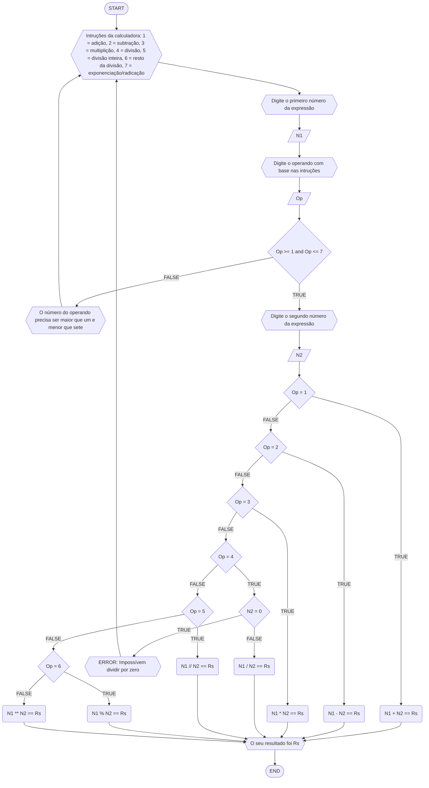

message.txt
# Questões de RLA
## 20 - A questão da calculadora
FLUXOGRAMA (mermaid flowchart)

Pseudocódigo
```
1 Algoritimo Calculadora
2 Declare N1,
3         N2,
4         Rs: float
5         Op: int
6 INICIO
7 ESCREVA "Intruções da calculadora: 1 = adição, 2 = subtração, 3 = multiplição, 4      = divisão, 5 = divisão inteira, 6 = resto da divisão, 7 = exponenciação/radicação" 
8 ESCREVA "Digite o primeiro número da expressão"
9 LEIA N1
10 ESCREVA "Digite o operando com base nas intruções"
11 LEIA Op
12 SE Op >= 1 e Op <= 7
13     ESCREVA "Digite o segundo número da expressão"
14     LEIA N2
15     ESCOLHA
16         CASO Op =  1
17             N1 + N2 == Rs
18         CASO Op =  2
19             N1 - N2 == Rs
20         CASO Op = 3
21             N1 * N2 == Rs
22         CASO Op = 4
23             SE N2 = 0
24                ESCREVA "ERROR: Impossível dividir por zero"
25                   VOLTE PARA 1 								// é assim? 
26		 	   SENÃO
27                N1 / N2 == RS
28             FIM_SE   
29         CASO Op = 5
30             N1 // N2 == Rs
31         CASO Op = 6
32             N1 % N2 == Rs
33         SENÃO
34             N1 ** N2 == Rs  
35		   FIM_ESCOLHA 
36 ESCREVA "O seu resultado foi", Rs    
37 FIM_ALGORÍTIMO
```
