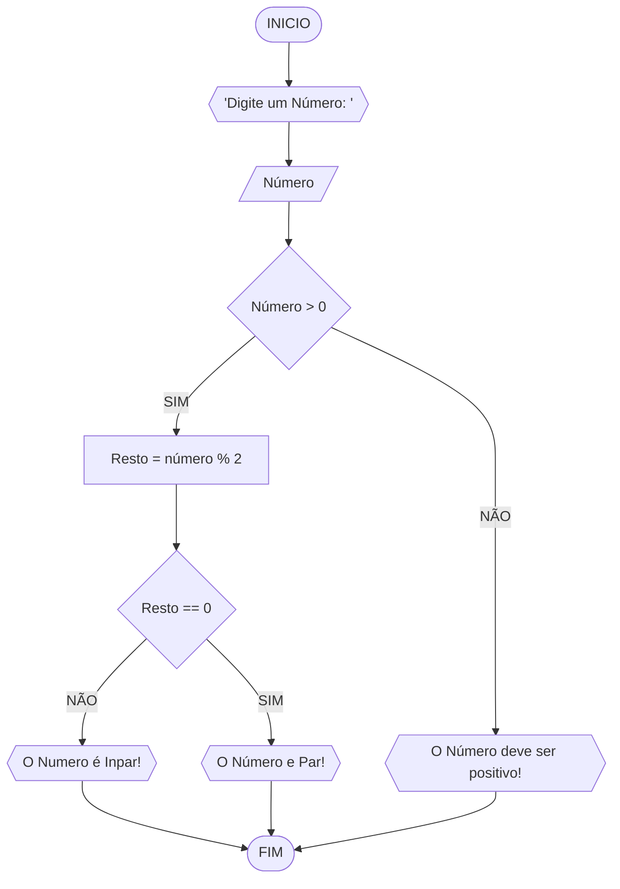

# UNIFOR
**Diciplina** Racíocinio logico Algoritimo
**Orientador**  Prof Ricardo Carubbi
## Lista de Exercícios
### Exercício  3

#### Fluxograma 

####  Pseudocodigo
```
1 ALGORITIMO verifica_par_inpar
2 DECLARE numero, resto NUMERICO
3 ESCREVA "Digite um número:"
4 LEIA número
5 SE numero > 0 ENTAO
6      resto = número % 2
7      Se resto == 0 ENTÃO
8          ESCREVA" número é Par""
9      SENÃO
10         ESCREVA" Número é Inpar"
11 SENAO
12      ESCREVA `"O número deve ser positivo!"
13 FIM_ALGORITIMO
```


